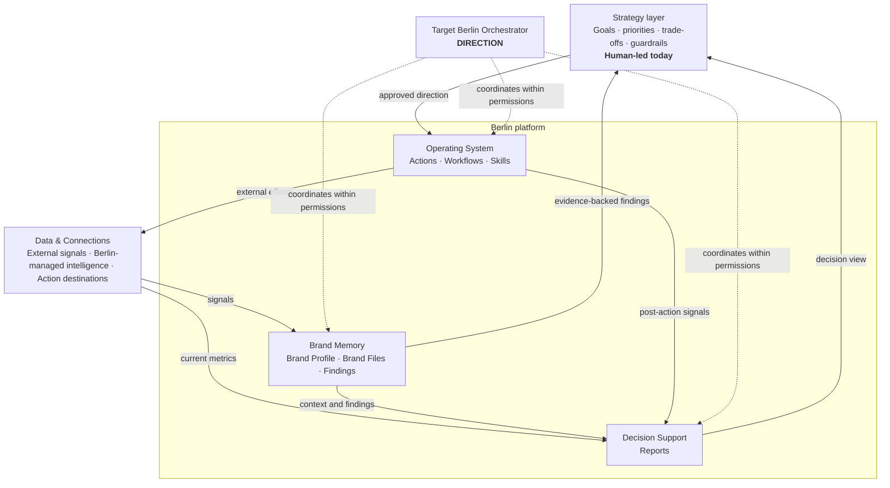
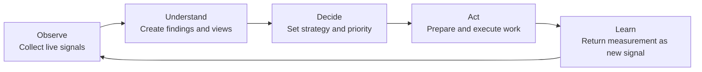

# Berlin — Cofounder Product Onboarding & Demo Deck Brief

**Audience:** Two incoming cofounders seeing Berlin for the first time  
**Purpose:** Give the design team the product narrative, slide content, demo flow, diagrams, terminology, and status rules needed to build an internal onboarding deck  
**Date:** 30 July 2026  
**Classification:** Internal working document. Not customer-facing copy.

---

## 1. The answer in one page

### The meeting outcome

By the end of the meeting, the cofounders should be able to explain:

1. what Berlin is and is not;
2. how work moves from evidence to execution;
3. where human strategy belongs today;
4. what each core product object means;
5. what is live now versus target-state;
6. what must change before Berlin can become self-serve SaaS.

This should feel like a product orientation and alignment session, not a sales pitch or a tour of every screen.

### The recommended product sentence

> **Berlin is the agentic operating layer for AEO: it turns fragmented brand and search signals into decision-ready evidence, execution-ready actions, and measurable feedback.**

The shorter deck headline is:

> **Berlin compresses the distance from evidence to shipped AEO work.**

### The essential boundary

> **Berlin operationalizes the work. Strategy chooses the work.**

Today, Berlin gathers evidence, maintains brand memory, supports analysis, runs repeatable procedures, and prepares execution-ready actions. Selected, verified paths may execute against connected systems; other actions route through human review. A human strategist remains accountable for objectives, prioritization, trade-offs, sequencing, and novel judgment.

Berlin is therefore not “the strategy” today. It is the system that makes a strategist dramatically faster and makes successful strategy increasingly reusable.

### The internal AEO truth

Our internal working model is that roughly **70% of AEO rests on traditional SEO foundations**. AEO adds answer-engine-specific measurement, entity clarity, citations, source influence, and off-site presence; it does not replace crawlability, content quality, search demand, technical health, or authority.

Treat 70/30 as an internal heuristic, not a research-backed external statistic. In public material, say:

> **AEO rests substantially on traditional SEO foundations, then adds answer-engine-specific visibility and authority requirements.**

### The productization flywheel

**DOCUMENTED:** human judgment is captured in Skills and Berlin’s internal strategy knowledge base.  
**DIRECTION:** first-class Playbooks, policies, guardrails, and broader orchestrated execution.

```text
Human judgment
    → repeated method
    → saved playbook
    → approved skills, workflows, policies, and guardrails
    → agent execution
    → measured outcome
    → better playbook
```

This is the route by which strategy progressively becomes part of the product. Strategies do not literally “become agents”; their repeatable operating logic becomes playbooks, skills, workflows, policies, and approval rules that agents can execute.

---

## 2. Recommended product model

Do not present Berlin as seven equal feature boxes. The seven objects are useful, but they only make sense inside a layered system.

### The five-layer mental model

1. **Data & Connections — where Berlin senses and acts**
2. **Brand Memory — what Berlin knows**
3. **Decision Support — what people need to understand**
4. **Strategy — what to do, why, and in what order**
5. **Operations — how Berlin monitors and carries out work**

The proposed **Berlin Orchestrator** is the target control plane around the system. Agents are the reasoning runtime inside it. The Orchestrator is **DIRECTION**, not a current unattended product claim.



### The operating loop

Use one explanatory loop consistently throughout the deck and demo:



Ownership today:

| Stage | Berlin’s role today | Human role today |
|---|---|---|
| **Observe** | Collect and organize connected, crawl, keyword, search, and competitor signals through scheduled workflows and data collection | Choose the relevant scope and objectives |
| **Understand** | Retrieve context, apply relevant skills, analyze evidence, create findings, and assemble reports | Validate interpretation and significance |
| **Decide** | Recommend and make the evidence usable | Own priorities, sequencing, trade-offs, and success criteria |
| **Act** | Prepare actions and execute through agents, approved procedures, and action connections | Approve sensitive or judgment-heavy work |
| **Learn** | Return measurements as new signals and surface patterns | Trigger the next interpretation, decide what the result means, and update Findings, Reports, or strategy where warranted |

The intended evolution is not “remove the human everywhere.” It is:

> **Move the human from repeated execution into policy, exceptions, and higher-order judgment.**

This five-stage loop expands the current **Audit → Report → Act** vocabulary; it does not silently replace it:

- **Audit** maps to Observe + Understand.
- **Report** is the human-readable decision and accountability surface.
- **Act** maps to preparation, review, execution, and verification.
- **Learn** closes the cycle by returning outcomes as fresh signals for the next operator-triggered interpretation.

---

## 3. The seven headline user-facing domain primitives

### Deck-safe ontology

These are the seven concepts to teach in the founder deck. Supporting domain and runtime concepts include Signals, Connections, Agent Runs, Outcomes, and the target Orchestrator. The proposed Playbook is a DIRECTION object.

| Primitive | Memorable definition | Precise product meaning | Usually created by | Feeds into |
|---|---|---|---|---|
| **Brand Profile** | What is enduringly true about the brand | Structured brand grounding: name and description, industries, business model, company size, target segments, geographies, competitors, and topic tree. Agent-assisted and human-correctable; it becomes the reference after verification. | Berlin research + user verification | Every agent run, finding, report, and action |
| **Brand Files** | What else Berlin should know | Free-form knowledge that does not fit the structured profile: tone, playbooks, customer research, internal rules, product docs, priority lists. | Brand, strategist, or operator | Relevant agent and skill runs |
| **Findings** | What research concluded | Persistent, evidence-backed research outputs about an opportunity, risk, anomaly, diagnosis, or hypothesis. Current shape: title, short description, and body. Provenance, freshness, and confidence are self-serve requirements rather than guaranteed current fields. | Strategist with an agent; sometimes a workflow’s output interpreted by an agent | Reports, strategy, actions, and new monitors |
| **Reports** | What people need to see | Living, audience-specific decision and accountability views composed from Findings and fresh Workflow data. A Report is a view, not canonical truth; action and outcome overlays are direction unless verified live. | Agent + strategist | Stakeholder decisions, prioritization, accountability |
| **Actions** | What is ready to happen | A finished, execution-ready artifact containing everything needed to carry out and verify the change—for example, final copy, a page-level specification, or an exact technical change. Current categories: off-site citation work, content create, content update, technical fix, validation, and custom. Not a vague to-do. | Agent + strategist, grounded in findings and strategy | Review, selected verified execution paths, verification, measurement |
| **Workflows** | What repeats predictably | In the current model, scheduled monitors that collect and process a defined slice of the AEO/SEO surface and leave structured output for a later agent run. | Strategist with agent assistance | Fresh signals for later agent interpretation, findings, and reports |
| **Skills** | How an agent knows to do something well | Saved, reusable procedures that tell an agent what to do, where to do it, and how. Skills are reusable across brands and stay dormant until an agent invokes them. | Berlin team or strategist | Agent runs and repeatable strategy execution |

### The terminology decisions

1. **Use “Brand Profile” for the structured object.**  
   “Brand Context” is ambiguous because it can mean the entire memory layer, the structured profile, or an auto-generated file. Use **Brand Memory** as the umbrella; Brand Profile and Brand Files sit inside it.

2. **Keep “Brand Files” in the deck.**  
   “Knowledge Assets” is a valid future label, but introducing it now creates needless distance from the current product language.

3. **Do not call Skills and Agents interchangeable.**  
   A **Skill** is a reusable procedure. An **Agent** is the reasoning executor that uses skills. The agent is an operating mechanism, not an eighth product primitive.

4. **Do not define Workflows by urgency.**  
   “Non-urgent” is a priority or SLA. The current distinguishing property is that workflows are predictable scheduled monitors. If event-driven or multi-step workflows are introduced later, update the definition then.

5. **Do not call an Action a task.**  
   The current product model treats an Action as the final execution-ready artifact. A task can still exist as UI language, but it should not blur the object model.

6. **Everything consequential should trace to evidence.**  
   A report claim and an action should be traceable to one or more findings. This is the basis for trust, review, and later autonomy.

### How Brand Memory reaches an agent today

- The Brand Profile is injected into brand-scoped agent runs.
- Brand File names and overviews are exposed; the agent retrieves a body when it is relevant.
- Finding titles and descriptions are exposed; the agent retrieves the body on demand.
- Customers can read Findings and Reports, but current editing happens through Berlin’s agent or Claude connected through the Agent Berlin MCP.

This catalogue-and-retrieve pattern is the plain-language explanation for how Berlin carries deep context without forcing every file and finding into every agent prompt.

### Signal, finding, report, and action are different

Use this example if the distinction becomes abstract:

- **Signal:** “This page lost 32% of impressions in four weeks.”
- **Finding:** “The decline appears concentrated in comparison queries where two competitors added more complete, recently updated pages.”
- **Strategy decision:** “Protect the existing page rather than create a new competing URL.”
- **Report:** A stakeholder view showing the decline, affected queries, competitor movement, proposed response, and later recovery.
- **Action:** The complete page update, including exact copy, structure, internal links, metadata, approval state, destination, and verification method.

---

## 4. Data, connections, agents, and orchestration

These are foundational system capabilities, not four more equal items in the feature list.

### Data & Connections

“Data source” is too narrow because Berlin both reads and writes. “Integrations” is also too narrow because Berlin owns important data infrastructure itself.

Use **Data & Connections** as the foundation label, with three clear groups:

| Group | Purpose | Examples |
|---|---|---|
| **External signal connections** | Read what is happening | Illustrative: Google Search Console, GA4, search and answer engines, and keyword providers. Show only connections verified in the demo workspace. |
| **Berlin-managed intelligence** | Maintain collected, licensed, and derived historical evidence in retrieval-ready form | Native brand and competitor crawls, versioned page history, licensed and derived keyword/ranking intelligence, and retrieval indexes |
| **Action destinations** | Publish or change something | CMS is the safest documented current example. Treat social and other publishing write paths as illustrative or DIRECTION until verified LIVE. |

A Connection may be read-only, write-only, or bidirectional.

Keep embeddings, vectorization, and retrieval architecture out of the core deck. The founder-level explanation is:

> **Berlin keeps brand, competitor, page, and keyword intelligence fresh and makes the relevant evidence retrievable to agents when they need it.**

### The current surface split

This is a load-bearing fact for both the demo and the self-serve discussion:

- **Operator surface today:** Claude connected to Berlin through the Agent Berlin MCP/CLI. The operator triggers intelligent runs, creates or updates Findings, shapes Reports, invokes Skills, and asks Berlin to create Workflows or Actions.
- **Customer/stakeholder surface today:** Berlin’s Dashboard, where progress, Reports, Actions, integrations, and review surfaces are exposed.

The demo script must say which surface is being shown whenever it switches. Do not imply that every operator action currently happens inside the Dashboard.

Current operator sessions are scoped to a brand/project and primary goal. Changing that scope can require a new configured session. A self-serve operator workspace should make brand, goal, permissions, and context scope persistent and visible instead of leaving them implicit in an MCP session.

### Agents

An Agent is a reasoning runtime. It reads relevant brand memory and evidence, invokes skills, interprets workflow output, and prepares Reports and Actions. Selected, verified paths may execute within granted permissions; other Actions route to review or manual execution.

Under the documented current operating model, intelligent agent runs are manually triggered by an operator. Scheduled data collection and monitor workflows can continue without a human.

### The target Berlin Orchestrator — DIRECTION

Use **Berlin Orchestrator** for the proposed outer control plane.

Its safe responsibilities are:

- watch schedules and events authorized by approved trigger policies;
- start and coordinate approved Workflow or Agent runs;
- route work to an approved Workflow definition or Agent template, with Agents limited to permitted Skills;
- manage dependencies, retries, and failures;
- enforce permissions and approval gates;
- surface exceptions to a human;
- maintain an audit trail.

Do not frame it as making unconstrained strategy or freely creating autonomous agents. The safe target-state is:

> **The Orchestrator may choose timing, routing, retries, and pre-approved Playbook branches. It may not change objectives, priorities, tactics, budgets, or approval policy without human authorization.**

For the meeting, show current coordination as the **operator + scheduler**. Depict the software Orchestrator and always-on intelligent control loop with dashed DIRECTION lines.

---

## 5. Strategy today and how it becomes product

### Strategy is a coherent set of choices, not merely a document

Strategy determines:

- the objective;
- the diagnosis;
- what matters now;
- what not to do;
- sequencing and trade-offs;
- expected outcomes and success measures;
- acceptable risk and approval requirements.

Berlin already contains reusable methods through Skills and an internal strategy knowledge base. The missing distinction is that Berlin does not yet autonomously own strategic prioritization for a brand.

### Introduce “Playbook” as the stored expression of strategy

For now, a brand-specific strategy can be stored as an ordinary Brand File. In the target product, it could become a first-class **Playbook** with:

- applicability conditions;
- goals and metrics;
- linked findings and rationale;
- prioritization rules;
- required actions;
- skills and workflows;
- permissions and approval requirements;
- guardrails and exception conditions;
- versions, owners, and measured outcomes.

The clean progression is:

```text
Strategy → Playbook → Policies + Workflows + Skills → Agent execution
```

This preserves the current platform-versus-strategy boundary while making the self-serve opportunity concrete.

Production Playbooks should not self-modify from one observed outcome. Proposed revisions must be evaluated, versioned, and approved. Only reusable methods Berlin has the right to retain and generalize may enter shared Skills or Playbooks; brand evidence, confidential strategy, and customer-specific instructions remain scoped to that customer’s organization/project.

---

## 6. Current product truth versus direction

The workspace does not contain the Berlin application or backend source, so this is a documentation audit, not code verification. Every live-demo step still needs a manual preflight.

Use three visual statuses throughout the deck:

- **DOCUMENTED** — supported by current operating documentation but not yet rehearsed in the meeting environment;
- **LIVE** — manually verified in the actual demo workspace, with an owner and verification date;
- **DIRECTION** — target-state or product proposal.

The table below is documentation-based. Promote a capability from DOCUMENTED to LIVE only after the demo preflight.

| Capability | Best-supported current status | Deck treatment |
|---|---|---|
| Brand Profile and Brand Files | Documented current | Mark DOCUMENTED until demo preflight |
| Findings | Documented current operating artifact; customer-readable, operator/agent-managed | Do not imply customer editing |
| Skills | Documented current reusable procedures | Explain that they do not run themselves |
| Workflows | Documented current scheduled monitors, with manual “run now” | Verify the specific monitor shown |
| Reports | Documented current living stakeholder views | Verify the specific report shown |
| Actions / Review Center | Documented; the detailed operating playbook is still incomplete | Verify the exact path before demo |
| External integrations and internal data substrate | Documented current and expanding | Avoid unverified connector claims |
| Intelligent agent runs | Documented as human-triggered in the current operator model | Show the Claude/MCP operator surface honestly |
| Always-on orchestrator | Target architecture in current documentation | Label DIRECTION |
| User-facing saved strategy object | Reusable strategy exists in Skills and the internal knowledge base; a brand-specific Playbook object is not established | Present Playbook as proposal/direction |
| Self-serve SaaS | Product direction / optionality | Present as a design and packaging decision, not a current mode |

### Important source-of-truth conflicts to avoid carrying into the deck

- Some older marketing material promises unattended autonomous execution; current product documentation says intelligent runs are operator-triggered.
- The verbal “seven items” includes Findings and excludes Integrations; the canonical product document includes Integrations and excludes Findings even though the operating playbook treats Findings as foundational.
- Current documentation uses **Brand Profile**, not Brand Context, as the structured object.
- Brand onboarding is described inconsistently: one source says profile research is operator-triggered, while the operating playbook says it is generated during onboarding. Do not claim either path until the demo workspace is verified.
- Older visuals may mix monitoring workflows with drafts and fixes even though the current operating model narrows workflows to scheduled monitors.
- Reports can mean a stakeholder-facing living report, a Report Center, or machine output from a workflow. Call workflow output **run output** or **structured signal**, not a report.
- The current product uses an **Organization → Project/brand** hierarchy. Treat “Brand Workspace” as a possible future plain-language label, not another live root object.

For this deck, use the ontology in Section 3 and mark anything beyond the verified current path as DIRECTION.

### Current surface labels to preserve in screenshots

Use the labels the cofounders will actually see, then explain the conceptual model around them:

- Dashboard / Home
- Brand profile
- Files
- Findings
- Report Center / Report pages
- Review Center
- Integrations
- Workflow cards for near-term runs, the later-workflow table, and **Run now**
- Organization and Project/brand

When moving into Claude with the Agent Berlin MCP, announce that the meeting is leaving the stakeholder Dashboard and entering today’s operator surface.

---

## 7. Recommended meeting run of show

Target: **45–55 minutes**

| Time | Section | Outcome |
|---:|---|---|
| 0–3 min | Why this meeting / AEO reality | Establish shared context |
| 3–9 min | Berlin’s role, boundary, and operating loop | Give them the minimum mental model before the UI |
| 9–12 min | Demo mission | Explain the one outcome they are about to see |
| 12–27 min | Live demo | Follow one opportunity from evidence to action |
| 27–38 min | Product map, autonomy, and data foundation | Name the system they just saw |
| 38–47 min | Strategy flywheel and self-serve path | Explain how the platform compounds |
| 47–55 min | Cofounder decisions | Leave with explicit decisions and owners |

If only 30 minutes are available, use Slides 1, 3, 5, 6, 8, 11, and 13; keep the demo to 10 minutes.

---

## 8. Slide-by-slide designer specification

### Slide 1 — Meet Berlin

**Eyebrow:** Cofounder product onboarding  
**Headline:** From AEO evidence to *shipped action.*  
**Subhead:** Berlin gives experts the memory, evidence, procedures, and execution rails to run AEO much faster.

**Visual:** A minimal evidence → decision → action loop. Do not start with screenshots or a feature collage.

**Speaker point:** “I want to give you the mental model first, then follow one real opportunity through the product.”

---

### Slide 2 — What we need to align on today (optional)

**Headline:** Four things to leave clear.

**On-slide copy:**

1. What Berlin is today  
2. Where human judgment belongs  
3. How the system works end to end  
4. What must change for self-serve

**Visual:** Four editorial checkpoints separated by hairline rules.

---

### Slide 3 — AEO rests on SEO

**Eyebrow:** Internal operating truth  
**Headline:** AEO is a new outcome built on a familiar foundation.

**On-slide structure:**

- **~70% SEO foundation:** crawlability, search demand, technical health, useful content, authority, rankings.
- **~30% answer layer:** prompt visibility, entity clarity, cited sources, off-site presence, answer-engine measurement.

**Visual:** A foundation-and-layer diagram, not a pie chart. Put “working internal model” beside the percentage.

**Speaker point:** “We position around AEO, but we should never confuse a new distribution surface with an entirely new discipline.”

---

### Slide 4 — The operating bottleneck

**Headline:** The problem is the distance between signal and action.

**Left — without Berlin:**

Connected tools → manual synthesis → fragmented judgment → scattered work → late measurement

**Right — with Berlin:**

Connected evidence → persistent brand memory → decision → operator-coordinated execution → feedback

**Visual:** A messy path resolving into one clean loop.

**Speaker point:** Berlin’s advantage is not merely generating content. It compresses the entire evidence-to-action cycle.

---

### Slide 5 — Platform versus strategy

**Headline:** Berlin accelerates the work. *Strategy chooses the work.*

| Berlin platform | Human strategy today |
|---|---|
| Collects and organizes evidence | Chooses the objective |
| Maintains brand memory | Prioritizes opportunities |
| Produces findings and decision views | Selects the tactic and sequence |
| Prepares execution-ready Actions; selected verified paths execute | Makes trade-offs |
| Tracks relevant post-action signals | Defines the baseline and what success means |

**Visual:** Two clear columns. Platform in ink; human strategy receives the single forest-green accent.

**Speaker point:** “Berlin is not missing strategy by accident. Strategy is a different accountability. What repeats and proves itself can then be encoded.”

---

### Slide 6 — The operating loop

**Headline:** Observe → Understand → Decide → Act → Learn

**Labels:**

- **Observe:** connections, crawlers, scheduled Workflows, keywords, pages, search and answer signals
- **Understand:** Brand Profile, Brand Files, Findings, Reports, and agents applying Skills
- **Decide:** strategist today
- **Act:** execution-ready Actions carried out by agents or people through selected, verified procedures and action Connections
- **Learn:** return post-action measurements as new signals; an operator-triggered agent then updates Findings, Reports, or strategy where warranted

**Visual:** The primary circular diagram. Put the strategist visibly at Decide. Put the Orchestrator as a subtle outer ring labeled DIRECTION.

---

### Slide 7 — Demo mission

**Headline:** Find and act on one real AEO opportunity.

**Scenario:**

> A competitor appears for an important commercial query or AI prompt while our brand does not. Berlin determines whether relevant content exists and assembles the evidence; the strategist chooses whether to improve, create, distribute, or defer.

**On-slide path:**

Objective + Brand Memory + Evidence → Finding → Decision View → Human Strategy Decision → Prepared Action → Approval / Execution → Outcome Signal

**Visual:** One horizontal golden path. Keep this slide visible while switching into the product.

---

### Live demo — 12 to 15 minutes

Use the script in Section 9.

---

### Slide 8 — The system map

**Headline:** Seven product objects. One foundation. One target control plane.

**Visual hierarchy:**

- **Brand Memory:** Brand Profile · Brand Files · Findings
- **Decision Support:** Reports
- **Strategy:** human-led today
- **Operations:** Actions · Workflows · Skills
- **Foundation:** Data & Connections
- **Outer control plane — DIRECTION:** Berlin Orchestrator

Do not render seven identical cards. Show the relationship and direction of flow.

**Speaker point:** “These are the objects and layers you just saw.” Name the memorable definitions after the founders have concrete product context.

---

### Slide 9 — Four mechanisms, four responsibilities

**Headline:** Berlin separates repeatability, intelligence, and coordination.

| Mechanism | What it is | Current activation |
|---|---|---|
| **Workflow** | Predictable scheduled monitor | Schedule or manual “run now” |
| **Skill** | Reusable procedure telling an agent how to do something | Invoked inside an agent run |
| **Agent** | Reasoning executor using context, evidence, tools, and skills | Human-triggered today |
| **Orchestrator** | Target control plane coordinating approved runs and exceptions | DIRECTION |

**Visual:** Four rows with DOCUMENTED / LIVE / DIRECTION status badges.

**Speaker point:** “The trigger is not the strategy. The target Orchestrator may choose timing, routing, retries, and approved Playbook branches. It may not change objectives, priorities, budgets, tactics, or approval policy without human authorization.”

---

### Slide 10 — Data & Connections

**Headline:** Berlin can sense the world and act in it.

**Three columns:**

1. **External signals**  
   Illustrative: Search Console, analytics, search and answer engines, keyword providers. Show only verified connections.

2. **Berlin-managed intelligence**  
   Brand and competitor crawls, versioned pages, keyword intelligence, retrieval-ready history

3. **Action destinations**  
   CMS as the verified current example; social and other publishing surfaces only where their write paths have passed demo preflight

**Visual:** Read arrows flow inward; action arrows flow outward. Avoid an integration-logo wall.

**Speaker note only:** page and keyword information is stored and indexed so agents can retrieve relevant evidence by meaning. Do not put “embeddings” or “vectorization” in the main slide.

---

### Slide 11 — Strategy becomes an asset

**Status:** DIRECTION

**Headline:** Every successful engagement can make Berlin more reusable.

**On-slide progression:**

Human judgment → Validated method / proposed Playbook → Policies + Skills + Workflows → Agent execution → Measured outcome

**Support line:** Human expertise moves from repeated task execution into policy, playbooks, guardrails, and exceptions.

**Visual:** A compounding loop in which the measured result goes through human evaluation before an approved, versioned Playbook revision. Do not imply self-modifying production strategy.

---

### Slide 12 — From internal product to self-serve

**Headline:** Self-serve is a product-design shift, not a pricing toggle.

**Three-stage maturity path:**

1. **Expert-operated platform — today**  
   An experienced operator drives Berlin through Claude + MCP/CLI; customers and stakeholders see the Dashboard.

2. **Guided expert platform — recommended first SaaS wedge**  
   Opinionated onboarding, one obvious first job, recommended next actions, evidence, approval gates, and reusable playbooks.

3. **Self-directed agentic platform — later**  
   Users set goals and guardrails; Berlin coordinates proven playbooks and escalates exceptions.

**Speaker note:** The recommended first wedge is SEO/AEO experts or agency operators. The two-surface implication—expert operator workspace versus stakeholder cockpit—belongs in the working session or appendix, not on this slide.

---

### Slide 13 — Cofounder decisions

**Headline:** What we need to decide together.

1. Who is the first user, and what is the first complete job Berlin should own end to end?
2. What is the default autonomy level: recommend, prepare, approve, or execute?
3. What remains human service, and what becomes software first?

End with decisions and owners, not a generic Q&A slide.

---

## 9. Live demo specification

### Demo principle

Do not tour menus. Tell one outcome story.

Use one seeded brand with complete, familiar data and one opportunity that has an obvious strategic fork.

Recommended scenario:

> An important commercial intent is visible in search or AI answers. A competitor is present; the brand is absent or under-covered. Berlin determines whether relevant content exists and assembles the evidence; the strategist chooses whether to improve, create, distribute, or defer.

### Golden path

1. **Ground the brand and objective**  
   In the Dashboard, show the current Project/brand, its Brand Profile, and one Brand File such as positioning, tone, product priorities, or customer research. State the target audience, topic, prompt, or business outcome.  
   Say: **“This is what Berlin knows, and this is the objective we are working against.”**

2. **Diagnose one opportunity**  
   Announce the switch into today’s operator surface: Claude connected through the Agent Berlin MCP. Show the relevant connected, crawl, competitor, keyword, prompt-visibility, GSC, or analytics evidence. Open the existing Finding or create/update it through the agent—not through a fictional Finding edit UI. Show its concise conclusion and supporting body. Show source/freshness only if those fields exist in the live workspace.  
   If a reliable Report naturally summarizes this decision, show it briefly; do not force a Report stop into the path.  
   Say: **“This is what changed, and this is the evidence-backed conclusion.”**

3. **Pause for human strategy**  
   Explicitly stop the automation story.  
   Say: **“Berlin has assembled the evidence. This is where the strategist chooses whether to update, create, distribute, or defer—and why.”**

4. **Prepare, review, and—if safe—execute the Action**  
   Start the relevant Agent run and show it invoking the saved Skill with the Brand Profile, Brand Files, and approved evidence. The Skill helps prepare the execution-ready Action; it does not run by itself.  
   Show the Action’s current guaranteed shape: its Finding-linked rationale, category, and self-contained execution payload or exact specification. Show owner, approval state, destination, expected outcome, or verification method only if those fields are verified in the live workspace. Switch back to the Dashboard/Review Center if that is where review occurs.  
   If live publishing to a verified CMS or another destination is safe, execute it. Otherwise, stop at review and approval.  
   Say: **“This is what is ready to happen.”**

5. **Show how the result returns as evidence**  
   Show the monitoring Workflow that revisits the relevant signal on a cadence, or its **Run now** path. Make clear that the Workflow observes; it does not execute the Action. Explain that post-action measurement returns as a new signal and a later operator-triggered Agent run may update the Finding or Report.  
   Say: **“This is how Berlin records the evidence needed to judge whether the action worked.”**

### Demo status discipline

Tag every demo step in the rehearsal notes:

- **LIVE:** reliable and will be shown in product;
- **EXPLAIN:** real but not useful to execute live;
- **DIRECTION:** shown only in the deck, never implied to be live.

If the Orchestrator does not have a reliable visible path, close the demo at monitoring and show orchestration only in the target-state diagram.

### Pre-demo checklist for today

- Use a brand you know deeply; do not discover the example during the meeting.
- Confirm the Brand Profile, Files, Finding, Report, and relevant Workflow load.
- Configure the Claude/MCP session for the correct Project/brand and primary goal; do not change scope mid-demo.
- Verify any claimed integration is connected and current.
- Use a test or approval-only Action; do not risk an accidental production publish.
- Remove credentials, customer-sensitive information, and unrelated browser tabs.
- Pre-run anything that may take longer than 15–20 seconds.
- Capture one current screenshot for every critical step as a fallback.
- Rehearse the golden path once against a 12-minute timer.
- If a screen conflicts with this ontology, explain the current label once; do not improvise a new definition.

---

## 10. Self-serve product implications

The product is confusing today because it grew around an expert operator whose mental model was never encoded into the interface. That is normal for an internal tool. Self-serve requires the interface to carry that missing expertise.

### Minimum requirements for a credible guided SaaS experience

1. **Opinionated onboarding**  
   Connect the domain and accounts, generate the Brand Profile, ask the user to verify uncertain fields, and explain why each connection matters.

2. **One obvious first job**  
   Do not open into seven empty object centers. Start with a complete outcome such as “find the highest-confidence content update opportunity and prepare it for approval.”

3. **Progressive disclosure**  
   Show the opportunity, evidence, recommendation, and next action first. Reveal workflows, skills, raw evidence, and logs when an expert asks.

4. **Evidence and provenance**  
   Every Finding should show source, observed date, freshness, confidence, and whether the statement is user-declared, connected-system fact, or agent inference.

5. **Clear object state**  
   Users need object-specific lifecycle states rather than one generic “task status.” A published Report should be a timestamped, versioned snapshot linked to its underlying evidence even if the working Report remains live.

6. **Approval-first external effects**  
   Default write operations to review. Allow per-category autonomy only after trust and explicit permission.

7. **Explainability at the decision boundary**  
   Show why an Action exists, which Finding, explicit user directive, or approved Playbook rule supports it, and what success will look like.

8. **Runs and auditability**  
   Every workflow or agent run needs inputs, outputs, status, cost, duration, errors, retries, and an audit trail.

9. **Recommended next actions**  
   Never make a new user infer which primitive to open next. Berlin should always explain the next best safe step.

10. **Two product surfaces over time**  
    Preserve a powerful expert operator workspace while giving stakeholders a much simpler outcomes-and-approvals cockpit.

11. **Visible scope**  
    Make the active Organization, Project/brand, objective, permissions, and context boundary persistent in the product. Today that scope is partly implicit in the configured operator session.

Recommended target lifecycles:

| Object | Target lifecycle |
|---|---|
| **Finding** | Proposed → Validated / Dismissed → Resolved / Stale |
| **Action** | Draft → Ready for review → Approved → Executing → Executed → Verified / Failed |
| **Agent or Workflow Run** | Queued → Running → Succeeded / Failed / Cancelled |
| **Workflow** | Draft → Active → Paused → Retired |
| **Playbook — DIRECTION** | Draft → Approved → Active → Retired |
| **Report** | Live view and/or Published snapshot; may become Stale |

Under the current definition, an Action should enter Berlin only when its payload is execution-ready. The **Draft** stage above is a target-state product choice; it may instead remain inside the Agent Run until the Action is ready for review.

---

## 11. Designer direction

The design should use Berlin’s editorial cream/paper identity and remain calm, specific, and internal—not glossy or hype-heavy.

### Brand execution

- **Background:** Paper `#FBF4E6`
- **Primary text:** Ink `#0F0F0E`
- **Accent:** Forest green `#1F4938`, used sparingly
- **Headline:** Instrument Serif, weight 400
- **Body:** Geist
- **Labels/status:** Geist Mono, uppercase
- **Structure:** hairline rules, generous whitespace, editorial columns
- **Avoid:** gradients as focal elements, glassmorphism, card walls, neon “AI” styling, robot illustrations

### Diagram semantics

- **Solid line:** behavior verified LIVE in the demo workspace
- **Dotted line:** DOCUMENTED behavior not yet rehearsed
- **Dashed line:** DIRECTION
- **Forest green:** human decision boundary or the one focal point on the slide
- **Ink:** Berlin platform
- **Green live dot:** verified live or scheduled activity
- **Status badge:** DOCUMENTED / LIVE / DIRECTION
- **Arrow inward:** Berlin senses or retrieves
- **Arrow outward:** Berlin acts on a connected destination

### Reuse one master product map

Build the architecture diagram once and reuse highlighted states:

1. full system map;
2. Brand Memory highlighted;
3. strategy boundary highlighted;
4. operations highlighted;
5. Data & Connections highlighted;
6. Orchestrator ring highlighted.

Repeated visual grammar will make a complex product feel learnable.

### Screenshot treatment

- One screenshot should prove one step in the golden path.
- Crop tightly around the relevant object.
- Add no more than two annotations per screenshot.
- Use captions that state the job, not the menu name.
- Never use a screenshot to claim target-state functionality.
- Do not reuse `marketing/partners-page/home.png` or `marketing/partners-page/workflows.png` as current-state proof without recapturing the live product. They use autonomous “tasks running” language and mix monitors with execution jobs in ways that conflict with the current operating model.

---

## 12. Working copy glossary

These definitions keep the deck consistent without prematurely declaring target-state terms canonical.

### Current terms

| Term | Use this meaning |
|---|---|
| **Organization** | Current team/access container holding multiple Projects |
| **Project / brand** | Current root scope for one brand’s Profile, Files, Findings, Reports, Actions, Workflows, and Connections |
| **Brand Profile** | Structured brand record, corrected and verified by a human |
| **Brand Files** | Additional documents and instructions Berlin may need |
| **Finding** | Persistent evidence-backed research conclusion; current shape is title, short description, and body |
| **Report** | Human-readable, audience-specific decision and accountability view |
| **Strategy** | The choices about objective, priority, sequence, constraints, and trade-offs; human-owned today |
| **Action** | Finding-grounded, finished execution package or exact specification |
| **Workflow** | Predictable scheduled monitor in the current product model |
| **Skill** | Saved reusable procedure used inside an Agent run |
| **Agent** | Reasoning executor that uses context, tools, and Skills; human-triggered today |
| **Connection** | A read-only, write-only, or bidirectional link to an external system |

### Recommended or target-state terms

| Term | Status | Use this meaning |
|---|---|---|
| **Brand Memory** | Recommended deck umbrella | What Berlin persistently knows about a brand: Profile, Files, and Findings |
| **Brand Workspace** | DIRECTION / naming option | Possible plain-language replacement for the current Project/brand scope; do not introduce it as another live root |
| **Playbook** | DIRECTION | Stored, versioned, approved operational expression of a strategy |
| **Run** | DIRECTION as a first-class surface | One Agent or Workflow execution instance, with status, logs, inputs, outputs, duration, and cost |
| **Data & Connections** | Recommended deck grouping | External signals, Berlin-managed intelligence, and authorized action destinations |
| **Orchestrator** | DIRECTION | Target control plane coordinating approved runs, permissions, failures, and exceptions |
| **Outcome** | DIRECTION as a first-class object | Observed post-action result with baseline, measurement window, and attribution confidence |

### Language to avoid

- “Skills and agents are interchangeable.”
- “Workflows are non-urgent jobs.”
- “An Action is a to-do.”
- “Berlin autonomously owns strategy today.”
- “The Orchestrator freely creates agents.”
- “Everything is an integration source.”
- “A workflow JSON output is a report.”
- “Berlin solves AEO automatically.”

### Preferred closing explanation

> **Berlin senses the AEO environment, remembers what matters about the brand, turns evidence into Findings, helps a strategist decide, prepares execution-ready Actions, carries selected approved work through verified Connections, and returns measurement as fresh evidence. As methods repeat and prove themselves, people can encode them into approved Playbooks, Skills, Workflows, and guardrails—so the system takes on more of the loop without losing accountability.**

---

## 13. Decisions to record after the meeting

The meeting notes should end with named owners and dates for:

1. canonical terminology;
2. the first self-serve persona;
3. the first end-to-end self-serve job;
4. default autonomy and approval policy;
5. current versus target Orchestrator scope;
6. whether Playbook becomes a first-class product object;
7. the operator-workspace versus stakeholder-cockpit sequence;
8. the north-star metric and outcome guardrails;
9. which product documentation becomes authoritative after the terminology is resolved.

Recommended metric split for that decision:

- **Preparation latency:** median time from a validated Finding to an Action ready for approval.
- **Execution latency:** median time from Action approval to verified execution.
- **Outcome guardrails:** the relevant visibility, citation, ranking, traffic, or conversion signals, measured against an agreed baseline and window.

Until these decisions are made, the deck must preserve the distinction between current product truth and the intended self-serve architecture.

---

## 14. Internal references used

- `canonical/product.md` — current descriptive product source of truth
- `canonical/engineering.md` — internal data, runtime, and strategy infrastructure
- `team/fdm-playbook/playbook.md` — current operator model for Findings, Workflows, Reports, Skills, and Actions
- `marketing/partners-page/home.png` and `marketing/partners-page/workflows.png` — non-canonical historical visuals; recapture before use

No Berlin application/backend source is present in this workspace, so the brief distinguishes documentation-backed behavior from behavior verified LIVE in the meeting environment.
